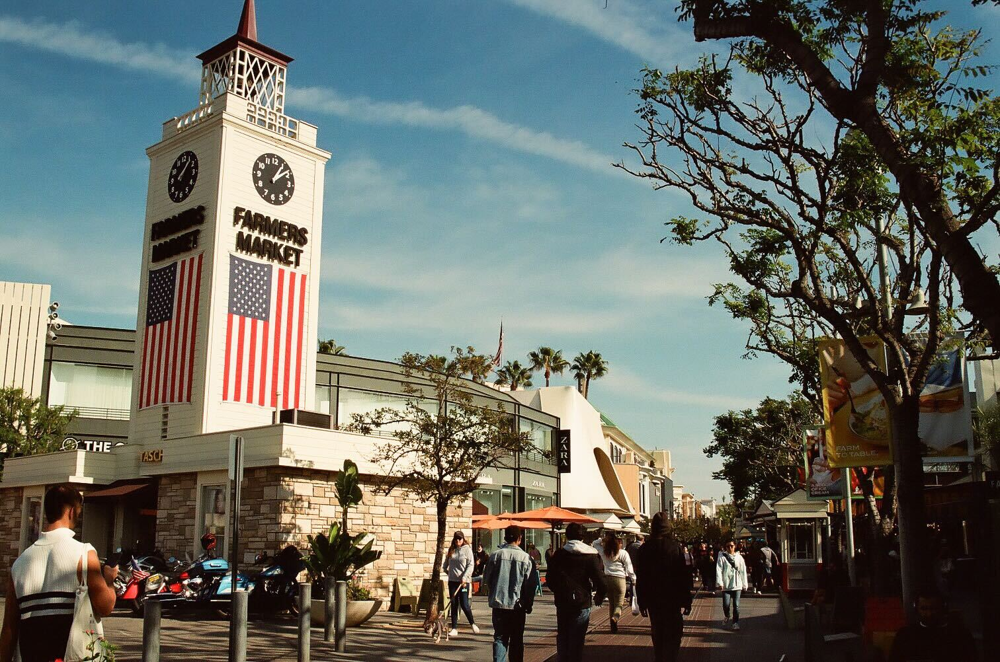

<!-- Main -->

<!-- One -->
<section id="one">
	

		<header class="major">
			<h2>Sed amet aliquam</h2>
		</header>
		
Nullam et orci eu lorem consequat tincidunt vivamus et sagittis magna sed nunc rhoncus condimentum sem. In efficitur ligula tate urna. Maecenas massa vel lacinia pellentesque lorem ipsum dolor. Nullam et orci eu lorem consequat tincidunt. Vivamus et sagittis libero. Nullam et orci eu lorem consequat tincidunt vivamus et sagittis magna sed nunc rhoncus condimentum sem. In efficitur ligula tate urna.

	

</section>

<!-- Two -->
<section id="two" class="spotlights">
	<section>
		
		

			

				<header class="major">
					<h3>Lookout!</h3>
				</header>
				
I love taking pictures, here is a picture of me. Don't I look good? This is my favorite picture. It's called "watching".

			

		

	</section>
	<section>
		
		

			

				<header class="major">
					<h3>Bush</h3>
				</header>
				
This is a bush. Wow.

			

		

	</section>
	<section>
		
		

			

				<header class="major">
					<h3>Grooovy?</h3>
				</header>
				
This is also a very nice picture 😉. Hopefully these pictures don't have metadata that can be used against me.

			

		

	</section>
	<section>
		
		

			

				<header class="major">
					<h3>Cool Building</h3>
				</header>
				
Look at this cool building, isn't it cool? I think it's cool.

			

		

	</section>
	<section>
		
		

			

				<header class="major">
					<h3>Market</h3>
				</header>
				
This is where I get my food lol.

			

		

	</section>
	<section>
		
		

			

				<header class="major">
					<h3>Minh</h3>
				</header>
				
Minh put a secret message in here? Don't really know what it means haha.

			

		

	</section>
</section>

